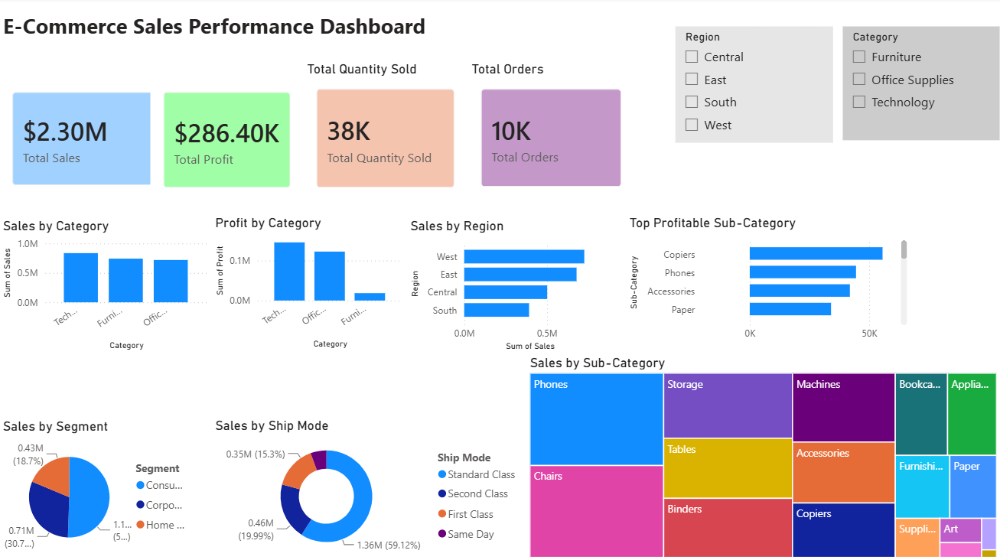

# 📊 E-Commerce Analytics Project

## Overview

This project analyzes E-Commerce sales data using SQL, Python, and Power BI to generate actionable business insights. The project demonstrates the complete data analytics workflow, from data exploration and analysis to dashboard creation and visualization.

---

## Project Objectives

- Analyze sales and profit performance
- Identify top-performing categories and products
- Compare regional sales performance
- Evaluate customer segments
- Understand shipping mode preferences
- Build an interactive Power BI dashboard

---

## Tools & Technologies

- Python
- Pandas
- NumPy
- Matplotlib
- Jupyter Notebook
- SQL
- Power BI
- Git & GitHub

---

## Dataset

The project uses the Sample Superstore dataset containing:

- Sales
- Profit
- Quantity
- Category
- Sub-Category
- Segment
- Region
- State
- Ship Mode

---

## Project Structure

```text
Ecommerce-Analytics-Project
│
├── data
│   └── SampleSuperstore.csv
│
├── dashboard
│   └── Ecommerce_Dashboard.pbix
│
├── notebooks
│   └── ecommerce_analysis.ipynb
│
├── sql
│   └── ecommerce_analysis.sql
│
├── images
│   └── ecommerce dashboard.png.png
│
└── README.md
```

---

## Dashboard Preview



---

## Key Performance Indicators (KPIs)

| KPI | Value |
|------|------|
| Total Sales | $2.30M |
| Total Profit | $286.40K |
| Total Orders | 10K |
| Total Quantity Sold | 38K |

---

## Dashboard Features

### Sales Analysis
- Sales by Category
- Sales by Region
- Sales by Segment
- Sales by Sub-Category

### Profit Analysis
- Profit by Category
- Top Profitable Sub-Categories

### Shipping Analysis
- Sales by Ship Mode

### Interactive Filters
- Region Filter
- Category Filter

---

## Key Insights

### Category Performance
- Technology generated the highest sales.
- Office Supplies delivered strong profitability.
- Furniture contributed lower profit compared to other categories.

### Regional Performance
- West region achieved the highest sales.
- South region generated the lowest sales.

### Sub-Category Performance
- Copiers were the most profitable sub-category.
- Phones and Accessories were among the top contributors.

### Shipping Preferences
- Standard Class was the most frequently used shipping mode.

---

## SQL Analysis

SQL queries were used to:

- Calculate total sales and profit
- Analyze category-wise performance
- Compare regional performance
- Generate business insights

---

## Python Analysis

Python was used for:

- Data Cleaning
- Exploratory Data Analysis (EDA)
- Data Visualization
- Business Insight Generation

Libraries Used:

```python
pandas
numpy
matplotlib
```

---

## Business Impact

This dashboard helps businesses:

- Monitor sales trends
- Track profitability
- Identify top-performing products
- Compare regional performance
- Support data-driven decision making

---

## Author

**Sanjiban Chattopadhyay**

Aspiring Data Analyst | Python | SQL | Power BI

GitHub:
https://github.com/Sanjiban480
